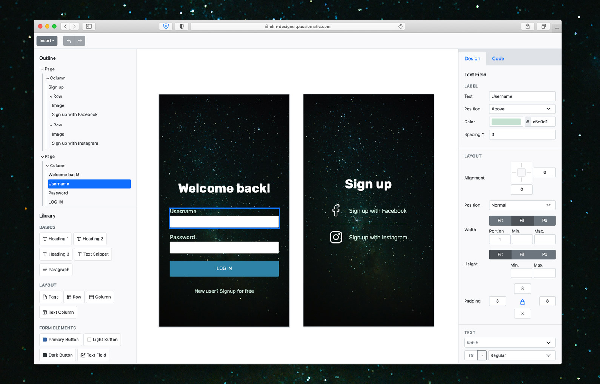

# Elm Designer—A code generator for Elm UI

## Current status

The application is in early stages of development and supports a subset of [Elm UI][elmui].

Previously Elm Designer was an Electrion app, you can download binaries on the [Releases page][r].

## About images

Images added to the page are automatically uploaded to [Null Pointer](https://0x0.st) service. According to Null Pointer terms of service uploaded images remain available up to one year (exact expiration depends on file size). 

By uploading images and referencing them by URL sidesteps a number of issues like: huge serialized JSON files, hit `localStorage` quota limits, and dealing with clumsy generated code.

## Known issues

- Color picker is quite limited at the moment since Elm Designer is using HTML 5 `input type=color`. Specifically you can't reset a color or specify `inherit`. See [#1][issue1]
- "Insert" menu allows to create non-renderable nodes. See [#20][issue20]

## Build Elm Designer from sources

Elm Designer uses [Parcel][2] to compile Elm and SASS source. To install all the needed dependencies type:

    npm install 

If you need to edit the source files the `package.json` contains a bunch on script entries which automate the most common operations. To run Elm Design locally in dev mode type:

    npm run dev

[2]: https://parceljs.org
[d]: https://github.com/passiomatic/elm-designer/releases/tag/v0.3.0
[issue1]: https://github.com/passiomatic/elm-designer/issues/1 
[issue2]: https://github.com/passiomatic/elm-designer/issues/2 
[issue20]: https://github.com/passiomatic/elm-designer/issues/20
[elmui]: https://github.com/mdgriffith/elm-ui
[r]: https://github.com/passiomatic/elm-designer/releases