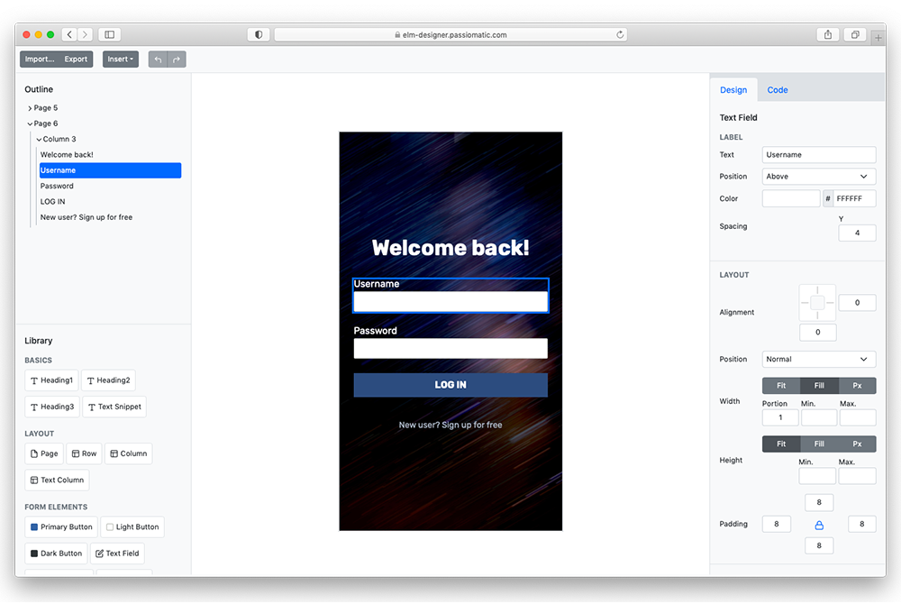

# Elm Designer—A code generator for Elm UI

## Current status

The application is in early stages of development and [supports a subset][support] of [Elm UI][elmui].

Previously Elm Designer was an Electron app, you can still download older versions on the [Releases page][r].

## New to Elm Designer? 

The [quick guide][guide] is waiting for you.

## About images

Images added to the page are automatically uploaded to [Imgbb][imgbb] servers and will remain available for 180 days.  

## Limitations

- UI is still pretty crude since the app is in an exploratory phase and I'm trying out different ideas.
- Color picker is quite limited at the moment since Elm Designer is using HTML 5 `input type=color`. Specifically you can't reset a color or specify `inherit`. See [#1][issue1]

## Build Elm Designer from sources

Elm Designer uses [Parcel][2] to compile Elm and SASS source. To install all the needed dependencies type:

    npm ci 

To run it locally in dev mode type:

    make dev

or if your prefer to turn off the Elm debugger type:

    make dev-no-debug

**Note**: you will need a valid [Imgbb API][api] key to be able to upload images. API access is free and requires only to sign up to the service. Once you get the API key set the `IMGBB_API_KEY` environment variable or create a `.env` file in the repo root containing such key:

    IMGBB_API_KEY=your-API-key

Then the build process will create a `Env.imgbbApiKey` value.

## Credits

Elm Designer contains patched versions of the following packages:

* [Elm Bootstrap][eb] is copyright (c) 2017, Magnus Rundberget  
* [Html5 Drag-Drop][hdd] is copyright (c) 2018, Martin Norbäck Olivers 
  
[2]: https://parceljs.org
[d]: https://github.com/passiomatic/elm-designer/releases/tag/v0.3.0
[issue1]: https://github.com/passiomatic/elm-designer/issues/1 
[elmui]: https://github.com/mdgriffith/elm-ui
[r]: https://github.com/passiomatic/elm-designer/releases
[api]: https://api.imgbb.com
[imgbb]: https://imgbb.com
[guide]: https://github.com/passiomatic/elm-designer/wiki/Quick-guide
[eb]: https://github.com/rundis/elm-bootstrap
[hdd]: https://github.com/norpan/elm-html5-drag-drop
[support]: https://github.com/passiomatic/elm-designer/wiki/Elm-UI-support-status
